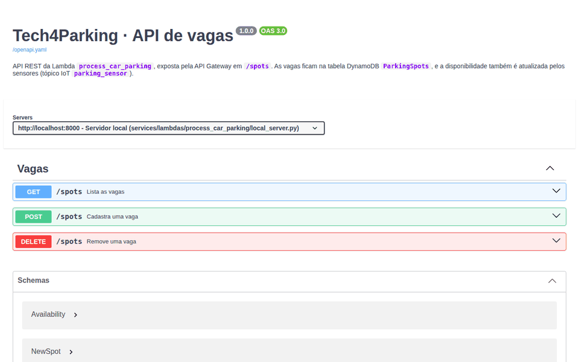
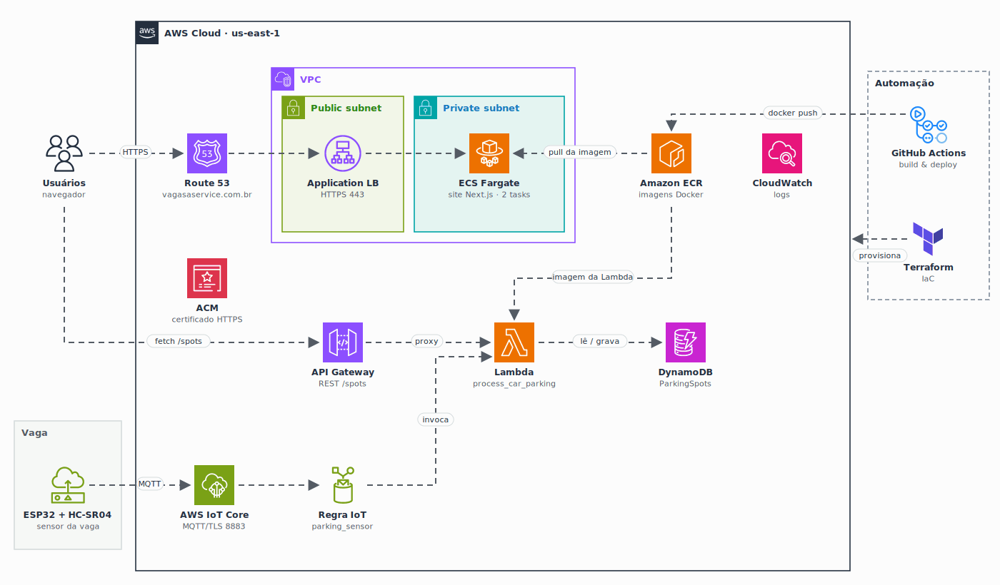

<p align="center">
  
</p>

<h1 align="center">
  Tech4Parking · Back
</h1>

<p align="center">
  
</p>

<p align="center">
  <a href="https://skillicons.dev">
    
  </a>
</p>

## Qual a finalidade do projeto?

Backend serverless do **Tech4Parking**. Uma única **AWS Lambda** em Python mantém o estado das vagas de estacionamento na tabela **DynamoDB** `ParkingSpots` e atende dois lados do sistema:

- os **sensores** das vagas, que chegam pelo **AWS IoT Core** sempre que uma vaga fica ocupada ou livre;
- o **web app**, que lista, cadastra e remove vagas pela **API Gateway**.

A Lambda roda como **imagem Docker** publicada no **Amazon ECR**, e o deploy é feito pelo **GitHub Actions**.

## Arquitetura

<p align="center">
  
</p>

## O que foi construído

### Lambda `process_car_parking`

| Item | Valor |
|---|---|
| Função na AWS | `process_car_parking-lambda-processing` |
| Repositório ECR | `process_car_parking-ecr-lambda` |
| Runtime | Python 3.12 (imagem `public.ecr.aws/lambda/python:3.12`) |
| Tabela | `ParkingSpots` (chave `spot_id`) |

### Eventos do sensor

Recebidos pela regra IoT do tópico `parking_sensor` ([tech4parking-iot](https://github.com/tech4parking-org/tech4parking-iot)):

```json
{"spot_id": "A-01", "status": "ocupada", "distance": 12.34}
```

Atualiza `availability`, `distance` e `updated_at` da vaga. Mensagens com status inválido são ignoradas.

### API `/spots`

Usada pelo [tech4parking-front](https://github.com/tech4parking-org/tech4parking-front):

| Método | Rota | Finalidade |
|---|---|---|
| `GET` | `/spots` | Lista as vagas |
| `POST` | `/spots` | Cadastra uma vaga: `{"name", "latitude", "longitude", "availability"}` |
| `DELETE` | `/spots?spot_id=<id>` | Remove uma vaga |
| `OPTIONS` | `/spots` | Preflight CORS |

`availability` é `ocupada` ou `disponível`. Todas as respostas trazem cabeçalhos CORS.

## Tecnologias utilizadas

- **Python 3.12 + boto3:** código da Lambda e acesso ao DynamoDB;
- **AWS Lambda:** execução serverless, empacotada como imagem Docker;
- **Amazon DynamoDB:** armazenamento das vagas;
- **AWS IoT Core:** entrada das mensagens dos sensores;
- **Amazon API Gateway:** API REST consumida pelo web app;
- **Amazon ECR:** registro da imagem da Lambda;
- **GitHub Actions:** build, push e atualização da função.

## Estrutura do repositório

```text
tech4parking-back/
├── .github/workflows/
│   └── deploy.yaml              # Build, push no ECR e update da Lambda
├── services/lambdas/process_car_parking/
│   ├── process_car_parking.py   # Handler: sensor + API /spots
│   ├── requirements.txt         # Dependências (boto3)
│   ├── Dockerfile               # Imagem da Lambda
│   ├── deploy.sh                # Deploy manual
│   └── local_server.py          # API local com Swagger UI (sem AWS)
├── docs/
│   ├── api-demo.gif             # Demonstração da API
│   ├── arch.gif                 # Diagrama da arquitetura
│   ├── logo.png                 # Logo T4Parking
│   └── openapi.yaml             # Especificação OpenAPI 3.0
└── README.md
```

## Fluxo de funcionamento

1. O sensor publica a mudança de ocupação no tópico `parking_sensor` do AWS IoT Core.
2. A regra IoT invoca a Lambda com a mensagem do sensor.
3. A Lambda atualiza a vaga na tabela `ParkingSpots`.
4. O web app chama `/spots` na API Gateway, que invoca a mesma Lambda.
5. A Lambda devolve a lista de vagas (ou cadastra/remove) com cabeçalhos CORS.
6. A cada push na `main` que altere a Lambda, o GitHub Actions gera a imagem, envia ao ECR e atualiza a função.

## Rodando a API localmente

O `local_server.py` roda o **mesmo `lambda_handler`** da Lambda, com uma tabela em memória no lugar do DynamoDB (já com vagas de exemplo), e publica a documentação no **Swagger UI**. Não precisa de conta AWS.

```bash
pip install boto3
python services/lambdas/process_car_parking/local_server.py
# Swagger UI: http://localhost:8000/docs
```

```bash
curl http://localhost:8000/spots
curl -X POST http://localhost:8000/spots -H "Content-Type: application/json" \
  -d '{"name": "Vaga E-03", "latitude": -23.5667, "longitude": -46.6749}'
curl -X DELETE "http://localhost:8000/spots?spot_id=A-01"
```

A especificação da API está em [`docs/openapi.yaml`](docs/openapi.yaml) (OpenAPI 3.0).

## Deploy

**Automático:** push na `main` alterando `services/lambdas/process_car_parking/**`, ou rodar o workflow manualmente. Secrets do repositório: `AWS_ACCESS_KEY_ID`, `AWS_SECRET_ACCESS_KEY` e `AWS_REGION`.

**Manual:**

```bash
AWS_ACCOUNT_ID=<id da conta> AWS_REGION=us-east-1 ./services/lambdas/process_car_parking/deploy.sh
```

A Lambda, o ECR, o IAM, a tabela, a API Gateway e a regra IoT são criados pelo Terraform em [tech4parking-infra](https://github.com/tech4parking-org/tech4parking-infra).

## Como validar a entrega

Em uma validação end-to-end, uma mensagem do sensor e uma chamada da API devem mudar e mostrar o mesmo estado da vaga na tabela `ParkingSpots`.

Pontos principais de validação:

- API local respondendo no Swagger UI (`http://localhost:8000/docs`);
- workflow **Deploy Lambda process_car_parking** concluído com sucesso;
- imagem publicada no ECR `process_car_parking-ecr-lambda`;
- `POST /spots` criando a vaga e `GET /spots` listando-a;
- mensagem publicada em `parking_sensor` atualizando `availability` da vaga;
- `DELETE /spots?spot_id=<id>` removendo a vaga;
- respostas com cabeçalhos CORS e logs da função no CloudWatch.

## Projeto Tech4Parking

| Repositório | Camada |
|---|---|
| [tech4parking-front](https://github.com/tech4parking-org/tech4parking-front) | Web app (Next.js) |
| **tech4parking-back** | Lambda de vagas (sensor + API) |
| [tech4parking-infra](https://github.com/tech4parking-org/tech4parking-infra) | Infraestrutura AWS (Terraform) |
| [tech4parking-iot](https://github.com/tech4parking-org/tech4parking-iot) | Firmware do sensor (ESP32) |

## Autor

**William Alves Coelho** · [@willtechdev](https://github.com/willtechdev)
